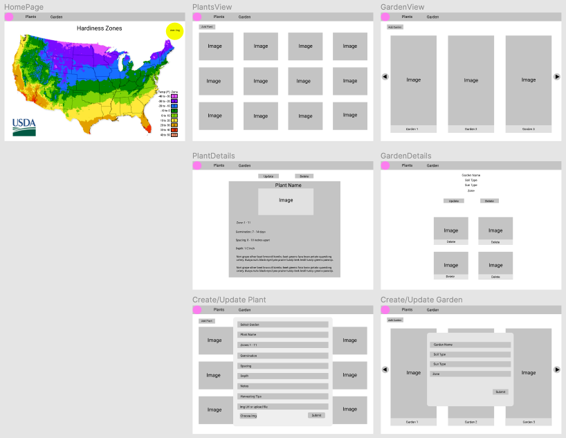
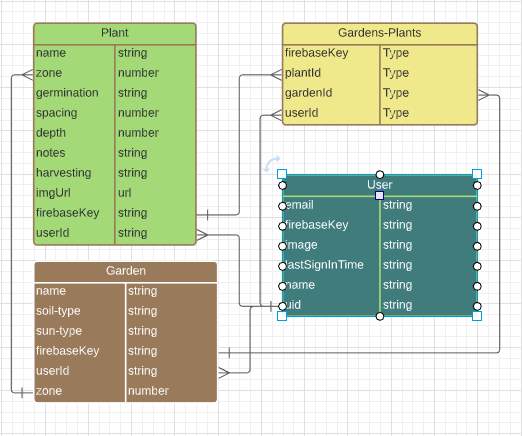

# Plant-It!
Planning/info app for your backyard garden. Backyard gardening has been a growing hobby(pun intended) especially this crazy year we call 2020. A few of the challenges people run into are not knowing enough details and forgetting what you've planted. One of the features this planting has is a map of the US that will show the zones so you know when to get your garden started. There will be an area where you can choose a vegetable that is already in the database or you can create your own. You can add plants to your garden and plan it out so you're not surprised when a cucumber is growing from where you thought your zucchini was.

## Loom
https://www.loom.com/share/f442d0120c9940218b91295524a92b5a

## Wireframe
https://www.figma.com/file/rXhu6Qrb3Y049LNdWDc5y5/Plant-It?node-id=0%3A1

## ERD
https://lucid.app/lucidchart/850e28d8-cdac-42f8-b2f2-4be8ab5f690a/edit?beaconFlowId=7C97A2C1BFB3974E&page=0_0#?folder_id=home&browser=icon

